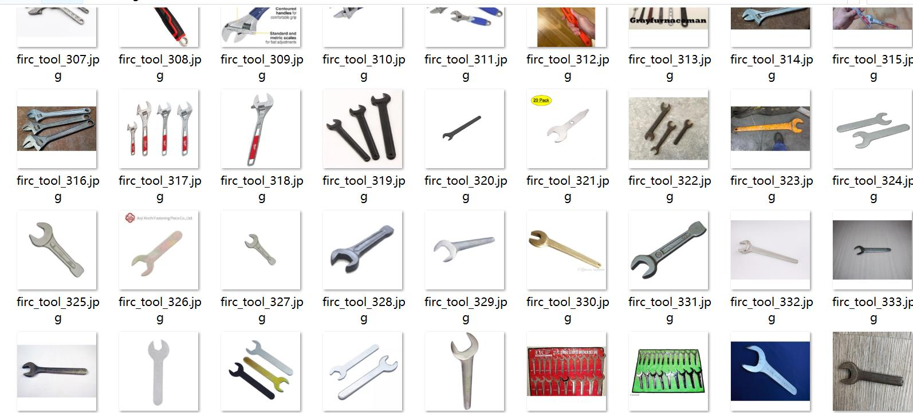
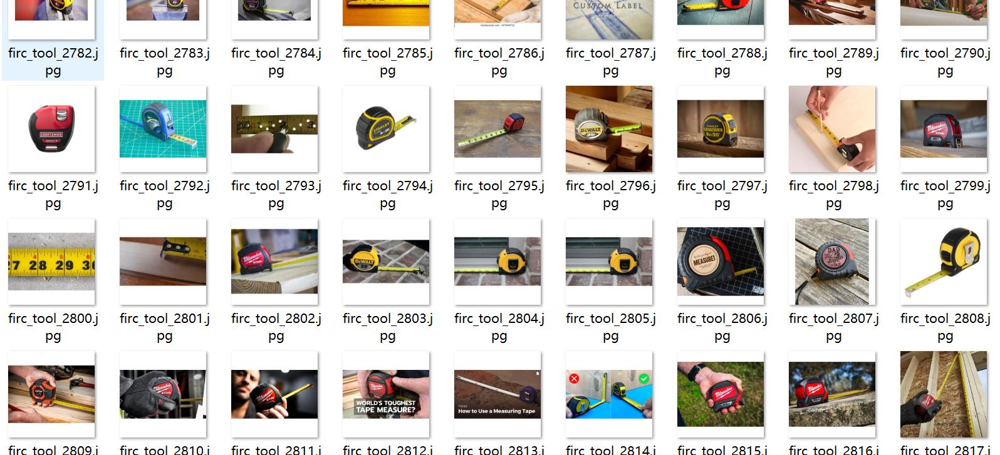
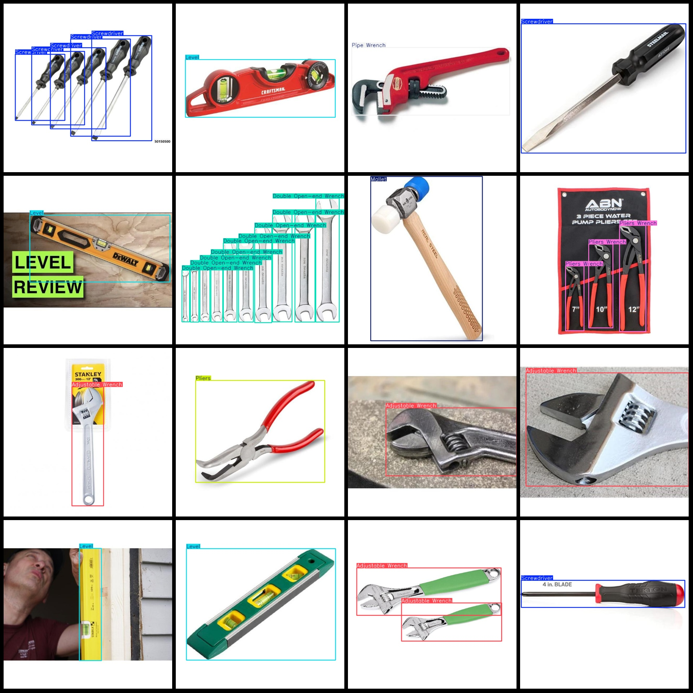
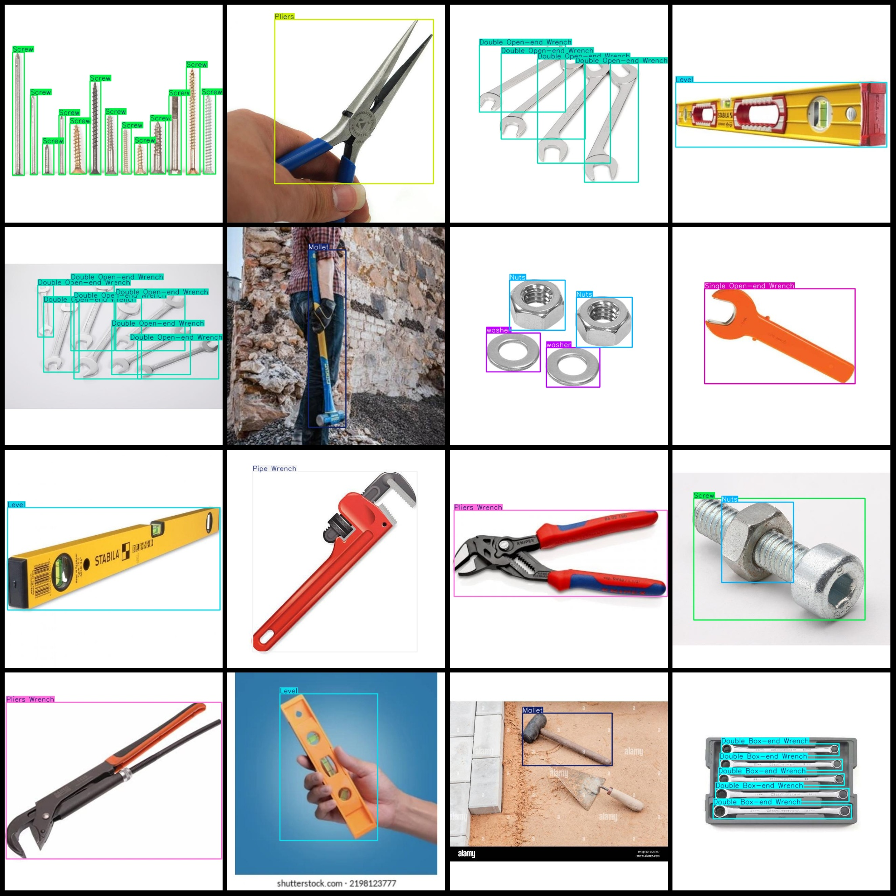

# Building Construction Tools and Repair Tools Data Set: 3150 Images in VOC+YOLO format, 16 Categories

Dataset format: Pascal VOC format+YOLO format (without split path txt file, only contain jpg image and corresponding VOC formatxml file and yolo formattxt file)
number of images: 3150  
annotation count: 3150  
annotation count: 3150  
annotationnumber of classes: 16  
Annotation class names: ["Adjustable Wrench", "Combination Wrench", "Double Box-end Wrench", "Double Open-end Wrench", "Hammer", "Level", "Mallet", "Nuts", "Pipe Wrench", "Pliers", "Pliers Wrench", "Screw", "Screwdriver", "Single Open-end Wrench", "Tape Measure", "washer"]
boxes per class:   
Adjustable wrench (active wrench) box count = 482
Combination Wrench (Horn Pliers/Claw Pliers) Frame Count = 277
Double box-end wrench (double-headed box-end wrench) has a frame count of 287.
Double Open-end Wrenchbox count = 427
The number of Hammer frames is 326.
The level (or calibration) box count is a measure of the number of boxes in a given area, which can be used to determine the accuracy and precision of a measurement device. In this case, the "level" refers to a device used for leveling or calibrating objects, such as in construction, manufacturing, or engineering applications. The number 394 indicates that there are 394 individual boxes or units within the area being measured.
Mallet (wooden mallet / rubber mallet) Frame Count = 344
Nut boxes count = 329
Pipe wrench (frames) = 373
"Pliers box count = 350" is a sentence in English. It translates to "The number of Pliers boxes is 350."
The number of pliers wrenches (box count) is 369.
Screw = 385
Screwdriver (screwdriver) Frame Count = 807
Single Open-end Wrench Frames = 379
Tape Measure Frames = 458
Washer Frames = 288
Total frame count: 6275
The number of images in each category:
This is a list of 271 images related to adjustable wrenches. The images are categorized into various categories such as different types of wrenches, different sizes and shapes of wrenches, different brands of adjustable wrenches, and different usage scenarios of adjustable wrenches. The images are mainly taken from the internet and some of them are copyrighted or belong to other websites.
Combination Wrench (Horn Wrench/Phillips Wrench) occupies a picture count = 63
Double Box-end Wrench images = 79
Double Open-end Wrench images = 117
HAMMER OCCUPIES 277
Level images = 346
Mallet images = 319
Nuts images = 146
Pipe wrench is a tool used for tightening and adjusting pipes. It consists of a handle, a shank, and a jaw. The shank is made of metal and has a threaded end that screws into the pipe. The jaw is designed to fit over the shank and hold the pipe in place.
Pliers (Tiger Clamps/Wire Cutters) fixture = 212
Pliers Wrench (Pliers Pliers) Ruler
The number of images with the term "screw" is 171.
The number of images for the Screwdriver (screwdriver) is 340.
Single Open-end Wrench images = 129  
Tape Measure images = 341  
washer images = 105
The resolution of the image is 640x640.
## Images

Here is a pay link on Stripe ( https://buy.stripe.com/3cs8yP7sY87d0vu9AB ). Please contact me lonlonago@foxmail.com after funding $89, and I will send you a complete data files , thank you!

